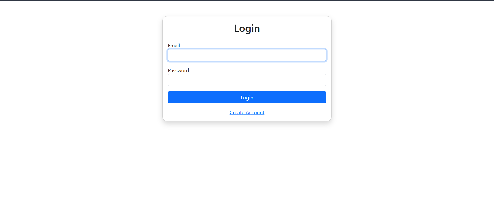
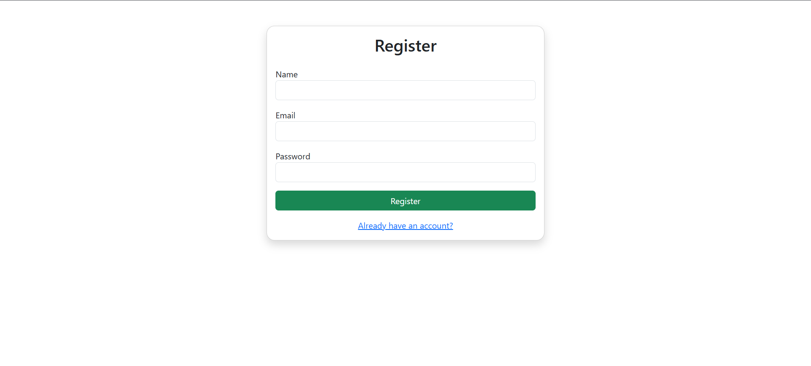
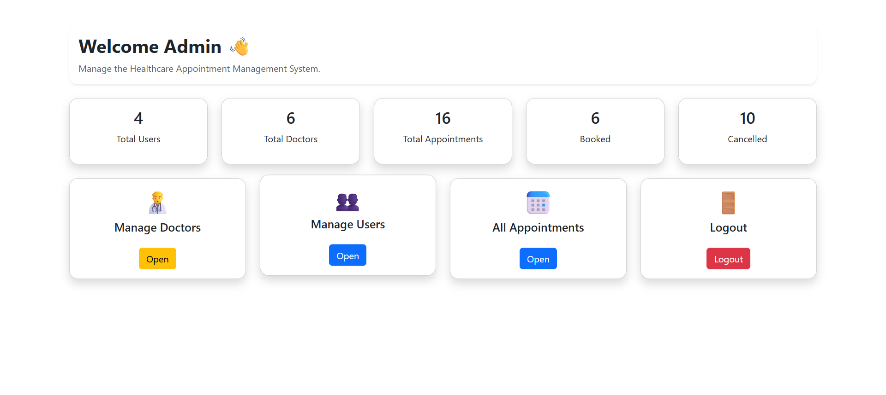
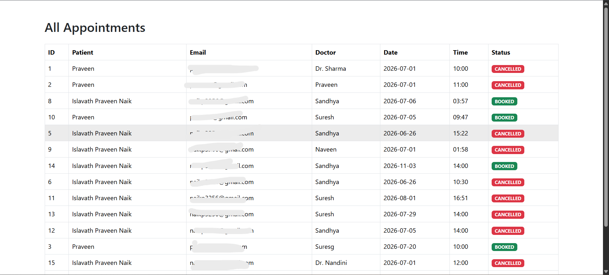
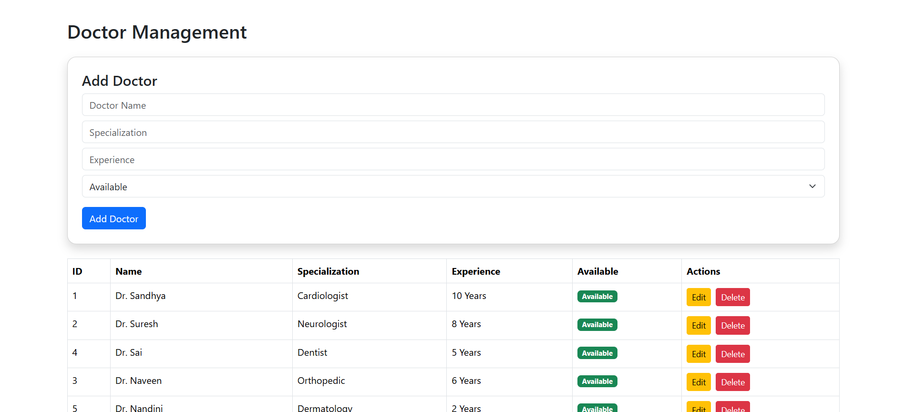
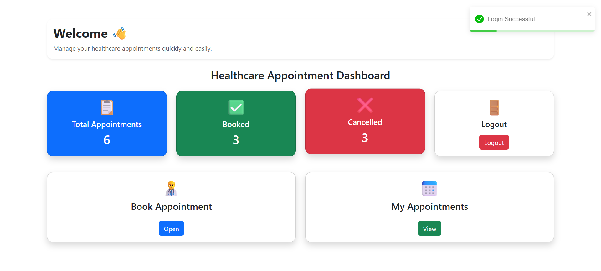
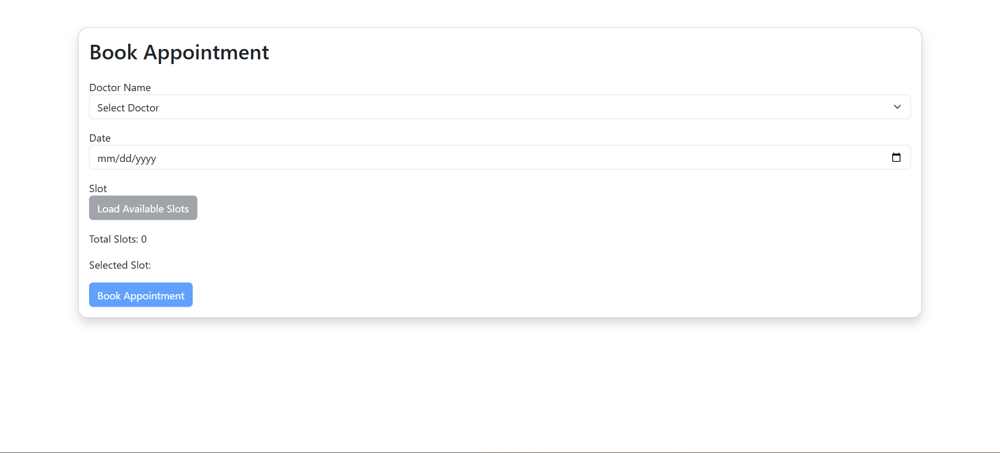
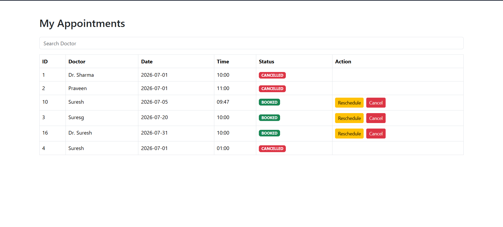

# 🏥 Healthcare Appointment Management System

> **Backend Engineer Assignment Submission**  
> Built beyond requirements — Spring Boot + Python Worker + Kafka + React + JWT + Swagger + PostgreSQL

---

## 📌 Assignment Coverage

| Requirement | Status |
|---|---|
| Spring Boot backend service | ✅ Done |
| Python worker/service | ✅ Done |
| Kafka event-driven communication | ✅ Done |
| PostgreSQL database integration | ✅ Done |
| JWT Authentication & Authorization | ✅ Done |
| Register / Login APIs | ✅ Done |
| Create / Cancel / Fetch Appointments | ✅ Done |
| Fetch Available Slots | ✅ Done |
| Prevent duplicate booking | ✅ Done |
| Concurrent request handling | ✅ Done |
| Appointment logs / history | ✅ Done |
| Swagger API Documentation | ✅ Done |
| React Frontend UI | ✅ Done |
| Doctor Management (CRUD) | ✅ Beyond requirement |
| Appointment Reschedule | ✅ Beyond requirement |
| Dashboard with stats | ✅ Beyond requirement |
| Real-time event status on UI | ✅ Beyond requirement |
| Email / SMS Notifications via Python worker | ✅ Beyond requirement |

---

## 📖 Overview

The Healthcare Appointment Management System is a **production-style full-stack platform** where patients can register, log in, and manage doctor appointments end-to-end.

The architecture follows an **event-driven microservices pattern**:
- The **Spring Boot service** handles all core business logic and REST APIs
- On every appointment event (booked / cancelled), Spring Boot **publishes a message to Kafka**
- The **Python worker** consumes Kafka events and processes notifications
- The **React frontend** reflects event/processing status in real time

---

## 🔄 System Workflow

```
User (React UI)
     │
     ▼
Spring Boot REST API  ──►  PostgreSQL (appointments, doctors, users)
     │
     ▼
Apache Kafka (topic: appointment-events)
     │
     ▼
Python Worker Service  ──►  Notification Processing
     │
     ▼
Status Update reflected on UI
```

---

## 🛠️ Tech Stack

| Layer | Technology |
|---|---|
| **Backend Core** | Java 21, Spring Boot, Spring Security, Spring Data JPA, Hibernate |
| **Authentication** | JWT (JSON Web Tokens) |
| **Database** | PostgreSQL |
| **Messaging** | Apache Kafka |
| **Worker Service** | Python (Kafka consumer + notification handler) |
| **API Documentation** | Swagger / OpenAPI 3 |
| **Build Tool** | Maven |
| **Frontend** | React, React Router, Axios, Bootstrap 5, React Toastify, Vite |

---

## 📁 Project Structure

```
Healthcare-Appointment-System/
├── healthcare-backend/              # Spring Boot REST API
│   └── src/main/java/
│       ├── controller/              # REST Controllers
│       ├── service/                 # Business logic
│       ├── repository/              # JPA Repositories
│       ├── model/                   # Entities (User, Doctor, Appointment)
│       ├── dto/                     # Request/Response DTOs
│       ├── security/                # JWT filter, config
│       ├── kafka/                   # Kafka producer
│       └── exception/               # Global exception handling
│
├── healthcare-frontend/             # React frontend (Vite)
│   └── src/
│       ├── pages/                   # Login, Register, Dashboard, Appointments
│       ├── components/              # Reusable UI components
│       ├── services/                # Axios API calls
│       └── context/                 # Auth context
│
├── python-worker/                   # Python Kafka consumer service
│   ├── consumer.py                  # Kafka event consumer
│   ├── notification_handler.py      # Notification processing
│   └── requirements.txt
│
├── screenshots/                     # UI screenshots
└── README.md
```

---

## ⚙️ Prerequisites

- Java 21+
- Python 3.9+
- Node.js 18+
- PostgreSQL 14+
- Apache Kafka (local or Docker)
- Maven 3.8+

---

## ▶️ Getting Started

### 1. Clone the Repository

```bash
git clone https://github.com/praveennaik94/Healthcare-Appointment-System.git
cd Healthcare-Appointment-System
```

---

### 2. Start Kafka (if not already running)

```bash
# Start Zookeeper
bin/zookeeper-server-start.sh config/zookeeper.properties

# Start Kafka broker
bin/kafka-server-start.sh config/server.properties
```

Or with Docker:
```bash
docker-compose up -d zookeeper kafka
```

---

### 3. Configure the Backend

Edit `healthcare-backend/src/main/resources/application.properties`:

```properties
# Database
spring.datasource.url=jdbc:postgresql://localhost:5432/healthcare_db
spring.datasource.username=your_db_username
spring.datasource.password=your_db_password
spring.jpa.hibernate.ddl-auto=update

# Kafka
spring.kafka.bootstrap-servers=localhost:9092
spring.kafka.producer.topic=appointment-events

# JWT
jwt.secret=your_jwt_secret_key
jwt.expiration=86400000
```

### Run the Backend

```bash
cd healthcare-backend
mvn spring-boot:run
```

Backend runs at: **`http://localhost:8080`**

---

### 4. Run the Python Worker

```bash
cd python-worker
pip install -r requirements.txt
python consumer.py
```

The Python worker connects to Kafka and starts consuming `appointment-events`.

---

### 5. Run the Frontend

```bash
cd healthcare-frontend
npm install
npm run dev
```

Frontend runs at: **`http://localhost:5173`**

---

## 📄 API Documentation

Swagger UI (available when backend is running):

```
http://localhost:8080/swagger-ui/index.html
```

---

## 🗄️ Database Schema

### Users
| Column | Type | Notes |
|---|---|---|
| id | BIGINT (PK) | Auto-generated |
| name | VARCHAR | Full name |
| email | VARCHAR | Unique |
| password | VARCHAR | BCrypt hashed |
| created_at | TIMESTAMP | |

### Doctors
| Column | Type | Notes |
|---|---|---|
| id | BIGINT (PK) | Auto-generated |
| name | VARCHAR | |
| specialization | VARCHAR | |
| available | BOOLEAN | |

### Appointments
| Column | Type | Notes |
|---|---|---|
| id | BIGINT (PK) | Auto-generated |
| user_id | BIGINT (FK) | References users |
| doctor_id | BIGINT (FK) | References doctors |
| slot | DATETIME | Booked time slot |
| status | ENUM | BOOKED / CANCELLED / RESCHEDULED |
| event_status | VARCHAR | Kafka processing status |
| created_at | TIMESTAMP | |
| updated_at | TIMESTAMP | |

---

## 🔄 Event-Driven Flow

1. User books or cancels an appointment via the React UI
2. Spring Boot saves the record to PostgreSQL
3. Spring Boot publishes a JSON event to the Kafka topic `appointment-events`
4. Python worker consumes the event, processes the notification
5. Processing status is updated and visible in the UI

**Sample Kafka Event Payload:**
```json
{
  "eventType": "APPOINTMENT_BOOKED",
  "appointmentId": 101,
  "userId": 5,
  "doctorId": 3,
  "slot": "2025-07-10T10:00:00",
  "timestamp": "2025-07-09T14:23:00"
}
```

---

## 🔐 Security

- All APIs (except `/auth/**`) require a valid **JWT Bearer token**
- Passwords are hashed using **BCrypt**
- JWT tokens expire after 24 hours (configurable)
- Global exception handling via `@ControllerAdvice`

---

## 🖥️ UI Screens

| Screen | Description |
|---|---|
| **Login** | JWT-secured login |
| **Register** | New user registration |
| **Dashboard** | Appointment stats (Total / Booked / Cancelled) |
| **Book Appointment** | Dynamic doctor & time slot selection |
| **My Appointments** | View, cancel, reschedule with event status |
| **Doctor Management** | CRUD — add/update/delete doctors |
| **Swagger UI** | Full interactive API documentation |

> Screenshots available in the `/screenshots` folder.

---

## 📸 Screenshots

### 🔐 Login


### 📝 Register


### 🛡️ Admin Dashboard


### 📊 Admin – All Appointments


### 👨‍⚕️ Doctor Management


### 👤 User Dashboard


### 📅 Book Appointment


.png)

### 📋 My Appointments


---

## 🔮 Future Enhancements

- [ ] Dashboard Charts & Analytics
- [ ] Docker Compose for full-stack deployment
- [ ] Unit Testing — JUnit & Mockito (Backend), pytest (Python)

---

## 👨‍💻 Author

**Praveen Naik**  
GitHub: [@praveennaik94](https://github.com/praveennaik94)  
Email: naikp3256@gmail.com  
LinkedIn: [linkedin.com/in/praveen-naik](https://www.linkedin.com/in/islavath-praveen-naik/)
